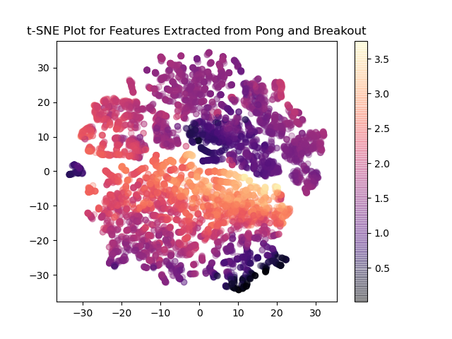
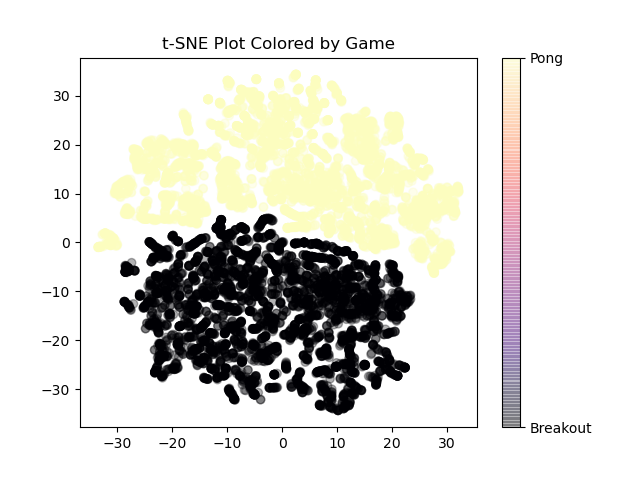
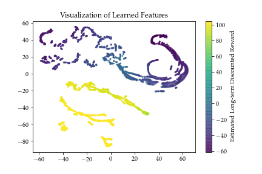
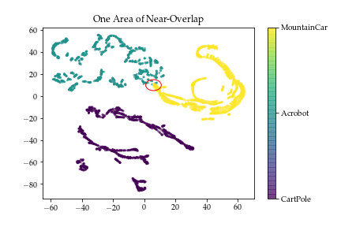
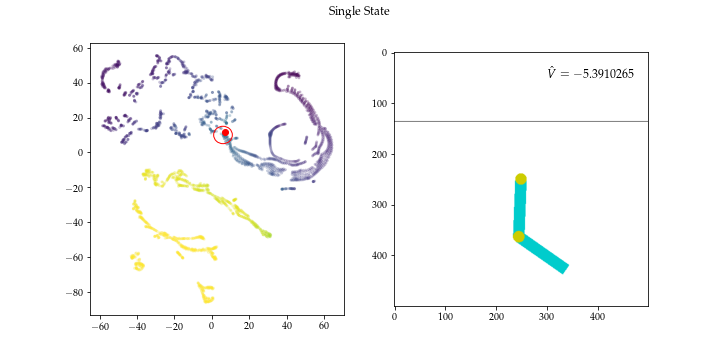
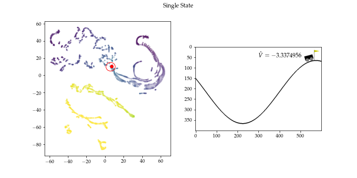

# Introduction

Multi-task reinforcement learning is an intriguing area of research for a number of reasons. Enabling a single learning system to learn multiple tasks while sharing many of the same parameters would allow for those tasks to be learned more efficiently, because sharing parameters among tasks means fewer parameters. Furthermore, as a system for feature extraction and knowledge representation, multitask learning may also allow the network to uncover and exploit similarities between tasks -- for example, in the Atari domain, the games of Pong and Breakout have very similar dynamics, and a multitask learning system which learns both of these games may be able to discover and exploit those dynamics more quickly. Finally, in a grander sense, biological agents are multi-task learners; if we wish to replicate biological intelligence, it stands to reason that we should understand how a single system can learn many different tasks and apply previously acquired knowledge to new tasks.

In @d2019sharing, the authors discuss the theoretical and empirical benefits of multi-task learning in a deep reinforcement learning context. They also present some empirical results to demonstrate that their theoretical analysis holds water in real problems. They choose a number of simple control tasks provided by the OpenAI Gym (@brockman2016openai) and PyBullet Gym (@benelot2018) libraries.

In this work, I attempt to replicate the results shown in @d2019sharing; I attempt to apply their proposed techniques to more complex learning tasks; and I examine the structure of the shared, learned features. In the interest of time and for compatibility with the original Atari learning system in @mnih2015human, I focus on the Q-learning applications.

# Application to Atari Environments

In order to evaluate the methods in this paper, I believe it is important to apply the techniques to a non-trivial learning task; for that purpose, I chose the "from-pixels" Atari environments provided in (@brockman2016openai). In these environments, the state is provided as a small (~210x160) RGB image which represents the current screen of the chosen Atari game. The action space is a discrete set of the actions that are coherent within each game; there are at most 16 actions, corresponding to the Cartesian product of the 8 directions the joystick can take with the binary state of the button.

Atari games are relatively simple (as video games go), and tend to fall into one of a few categories. Over the course of the experiments, I attempted to learn 10 games divided into three major categories:

1. "Space Invader"-like games, which involve the player shooting at descending enemies. The games in this category were Air Raid, Assault, Atlantis, Demon Attack, Space Invaders, and Centipede.

1. "Pong"-like games, which involve the player controlling a paddle, where the goal is to prevent a ball from getting past the player. The games in this category were Pong, Breakout, Tennis, and Video Pinball.

1. "Pacman"-like games, which involve the player controlling a character through a maze, attacking or avoiding enemies. Games in this category were Ms. Pacman, Berzerk, Bank Heist, and Alien.

For all of the Atari games, I applied the preprocessing discussed in @mnih2015human.

## First Experiment

For my experiments, I made a minor modification to the architecture presented in @mnih2015human to make it compatible with the architecture proposed in @d2019sharing. In this architecture, the first convolution layer is task-specific. Then, that first task-specific mapping is fed to the shared feature extraction network, which applies two additional convolutional layers, followed by a pair of dense layers which eventually output the 256 extracted, shared features. Those features are then fed to a simple, task-specific 2-layer dense network which outputs the estimated Q value for the given state.

I evaluated this architecture by attempting to learn Pong and Breakout, two of the Pong-like games. The agents were trained for ~350,000 steps and then the extracted features were examined in a t-SNE plot.

{#fig:atari-tsne}

Figure @fig:atari-tsne shows that t-SNE visualization. While there are not strongly-defined clusters, it does appear that similarly-valued states lie close to one another.

{#fig:atari-game-tsne}

Figure @fig:atari-game-tsne shows the same visualization, but with colors set by the game from which the features were derived. This plot shows clearly that the network was able to cleanly differentiate between the two games, which indicates that perhaps the network is actually performing as two networks in one, rather than extacting useful shared features of the environment.

## Second Experiment

I also attempted to implement another architecture for the Atari environments, sticking more closely to the principals of @d2019sharing. In this architecture, the goal was to process the task-specific screen input to a high-dimensional meta-state with the CNN stack of @mnih2015human. Then, the shared layers map that meta-state to a small set of shared features with values in (0, 1) via a three-layer dense network. Finally, the shared feature space is mapped to task-specific outputs by another short fully-connected layer. This functionality is implemented by the `MTQN` class in `qlearner.py` in the project code repository.

I trained this (and similar) architectures on various combinations of the Pong-like, Space Invaders-like, and Pacman-like games with no success. The network was never able to learn any of the games, and performance never grew beyond random play.

I believe that this approach could work with a bit more tweaking. Unfortunately, there is a significant computational cost to training these networks on the Atari environments (300,000 steps takes ~20 hours on the IUPUI graduate student servers), and I ran out of time to continue tweaking.

However, I think it serves an important lesson that attempting to implement this architecture to complex environments could lead to difficulty, and care must be taken.

# Examination of Learned Features in Control Tasks

In order to examine the features produced by this architecture, I recreated the author's experimental architecture for their deep multi-task Q-learning experiments. I ran a similar training schedule of 50 epochs of 1000 steps each. I used the architecture to learn three problems from the OpenAI Gym: `CartPole-v1`, `Acrobot-v1`, and `MountainCar-v0`.

After training had completed, I ran an additional 1000 steps with each of the trained agents and recorded every state they saw. Then, I fed those states through the first two components of the network to retrieve the learned features. Finally, I used a t-SNE embedding @maaten2008visualizing to visualize the space of learned features.

{#fig:tsne}

Figure @fig:tsne shows these results. The state samples exhibit clear structure, with similarly-valued states appearing close together.

{#fig:overlap}

However, looking at Figure @fig:overlap, it's clear that the network is able to clearly distinguish among the learned tasks, with one potentially interesting area of overlap.

Cross-referencing Figures @fig:tsne and Figure @fig:overlap, one can see that these similar areas are high-value states where the agent is very close to achieving the goal, as shown in Figures @fig:vis1 and @fig:vis2

{#fig:vis1}

{#fig:vis2}

# Conclusion

The authors report empirical results that indicate an improvement in performance that I was not able to test in this work. I attempted to investigate the claim that their approach leads to improvement by allowing a network to exploit shared features of the tasks being solved, and I was not able to find evidence that that is true in these limited experiments.

Based on my experiments, it appears that these networks have sufficient representational power to essentially learn the tasks independently. When I attempt to reduce the dimensionality of the feature space to force the learning of some perhaps interpretable feature, the system becomes incapable of learning any task.

It also deserves mention that their proposed architecture for solving these control problems involves ~13,000 parameters, while these problems can be solved with significantly fewer parameters (see `notebooks/simple.ipynb` in the project repository for an example with 130 parameters). This also makes me think that perhaps these networks have too much expressive power.

Of course, they do mention empirical success with improved learning rates and success with transfer learning, and this cannot be discounted. I am also considering that my expectations are incorrect; perhaps it's a good thing that the network is able to distinguish two fairly different problems based on the derived, set of shared features. Perhaps, with a wider array of learning environments, the network would be able to derive more coherent shared features.

# Code Repository

As referenced a few times in this paper, the repository for the experiments discussed here is available at https://github.com/csreid/atari-mtdqn, which includes some additional figures and Jupyter notebooks.

# References

